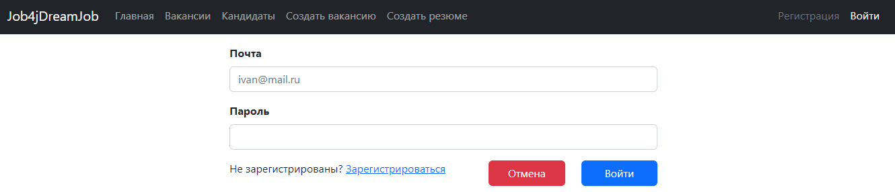
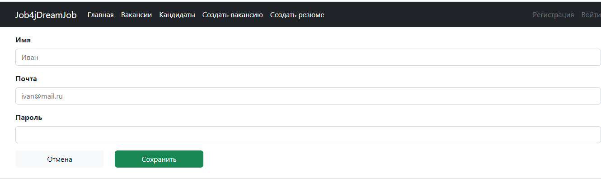
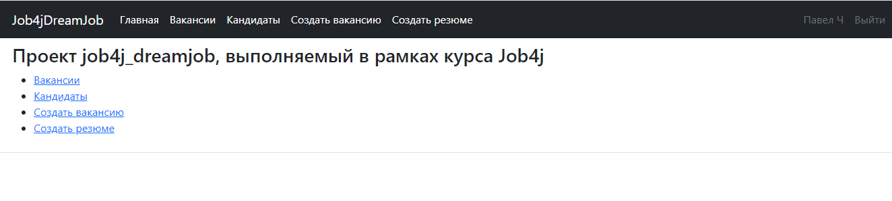
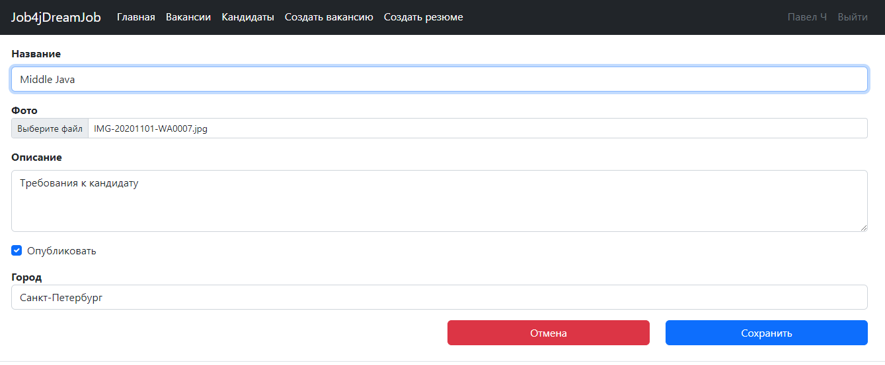
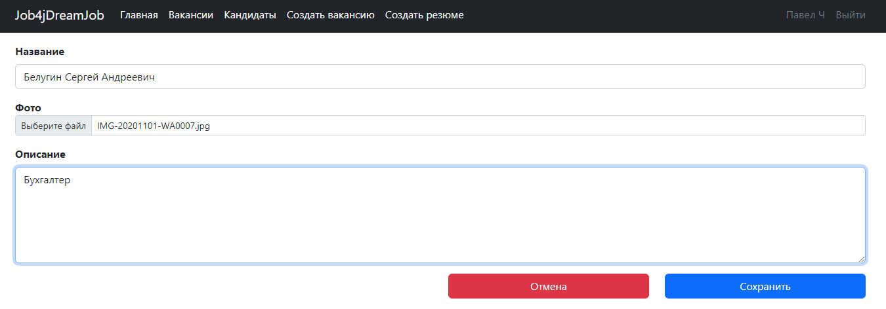
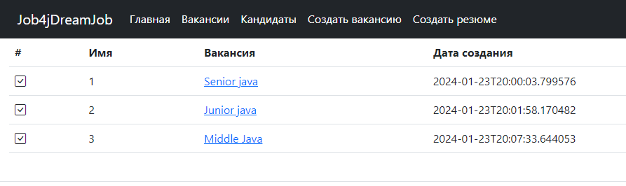
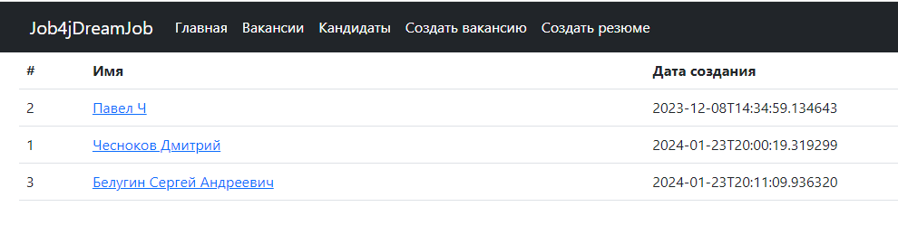
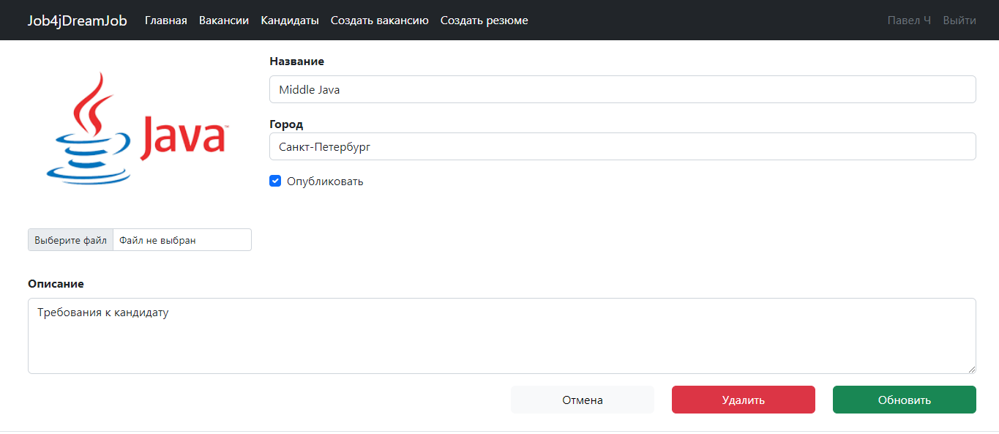
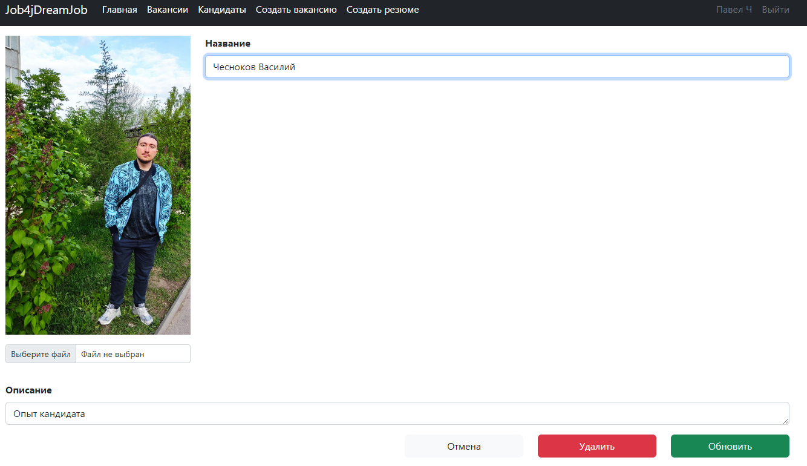

http://job4j.ru/
Проект агрегатор вакансий.
В системе две модели: вакансии и кандидаты. 
Пользователь может опубликовать/ректировать/удалить резюме или вакансию. 

### Требования к окружению:
Java 17;\
PostgreSQL 14;\
Apache Maven 3.8.4

### Стек технологий:
Spring boot 2.7.3;\
Thymeleaf;\
PostgreSql 42.2.9\
Sql2o 1.6.0

### Этапы развертывания проекта:
1. Клонировать проект из этого репозитория;
2. Создать локальную базу данных "dreamjob";
3. Прописать логин и пароль к созданной базе данных в файл db/liquibase.properties и application.properties;
4. Запустить liquibase для предварительного создания таблиц;
5. Запустить приложение;
6. Открыть в браузере страницу http://localhost:8080/index;

Вход и регистрация в приложении:

Главное меню:

Создание вакансии:

Создание кандидата:

Списки вакансий и кандидатов:

Редактирование карточек:

